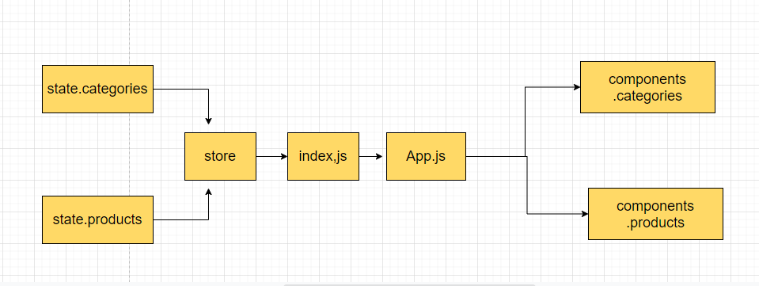

## Description

**Today, we begin the first of a 4-Phase build of the storefront application, written in React. In this first phase, our goal is to setup the basic scaffolding of the application with initial styling and basic behaviors. This initial build sets up the file structure and state management so that we can progressively build this application in a scalable manner.**

## Links

- [netlify:](https://reverent-brattain-b0e039.netlify.app/)
- [Sandbox](https://codesandbox.io/s/objective-curie-5ypt0)
- [Pull Request:](https://github.com/amroalbarham/storefront/pull/1)

## UML 

